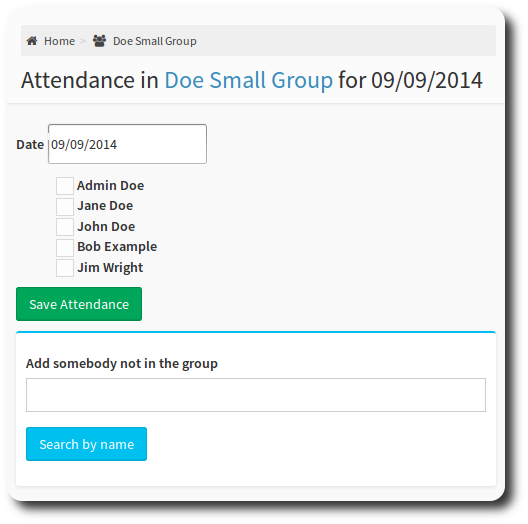
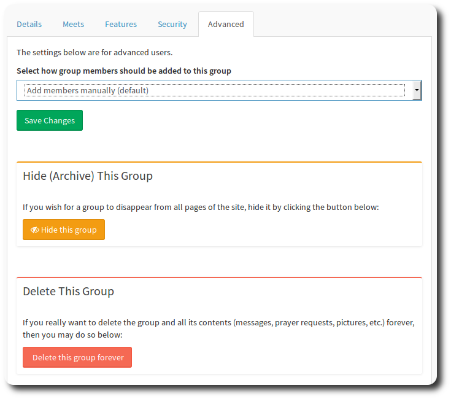

# Looking after Groups

If you're a group leader, or become a group administrator, you will find this section helpful.

> **Note** The sections that follow assume you are a group administrator.

## Tracking Attendance
OneBody allows you to track attendance in your group. This is particularly useful for small groups. To track attendance, you need to select the Attendance Tracking check box on the features tab of the group setup page.

To record attendance:
1. Go to the Group launch page
2. Select the group you want to record attendance for, and;
3. Select the **Track Attendance** button.

You'll see:

 

By default, OneBody will bring back the current members of the group. Simply select the members you want to record and Save Attendance. Its that easy.

Then:

* Use the **Add somebody** search box if you want to record someone who doesn't normally come to the group. The person will need to be a Onebody member.

* If you need to record additional attendees, just go back to the attendance screen and add them. Any attendees previously saved will be retained.

* Head on over to [Attendance](../administration/attendance.html) to report attendees per date.

## Advanced Group Options

 

**Membership Methods**

OneBody supports three different types of groups (and membership):

1. [Standard groups](#standard-group):  where someone goes in and adds people (or people request to join)
2. [Linked groups](#linked-group): where membership is based on an outside source, based on a "link code"
3. [Parents of groups](#parents-of-groups): Groups are composed of  pulling parents of children from another group.

For all group types, members can choose to stop receiving email from the group by clicking a simple link within one of the emails or by turning off email from their profile while logged in.

### Standard Group

There's not much to say about this group type, as it works about like you'd expect. The group admin can add and remove people through OneBody. People can request to join a group (must be confirmed by a group admin) and choose to leave the group at any time.

### Linked Group

First, let's talk a bit about [UpdateAgent](https://github.com/churchio/onebody-updateagent). UpdateAgent allows you to load a csv file of person and family data.

** The "Classes" Field **

One of the fields imported through UpdateAgent (or via the simple web-based CSV import) is the "classes" field. This is a simple text field where you can store unique group ids from your external data source, separated by comma.

** The "Link Code" Field **

When editing groups, you may have noticed the "Class Link Code(s)" field. This is a space to enter one or more codes from the "classes" field we talked about above. When this field contains something, membership in that group is said to be "linked," meaning it is automatically managed by the system, based on data passed in through data synchronization (and available in the "classes" field).

### Parents of Group

If you select a group for the "Parents of" field when editing a group, then membership in that group is automatically generated based on pulling parents of kids/youth from the selected group.

 > **Danger** The Hide and Delete Group buttons - do what they say :).

---
