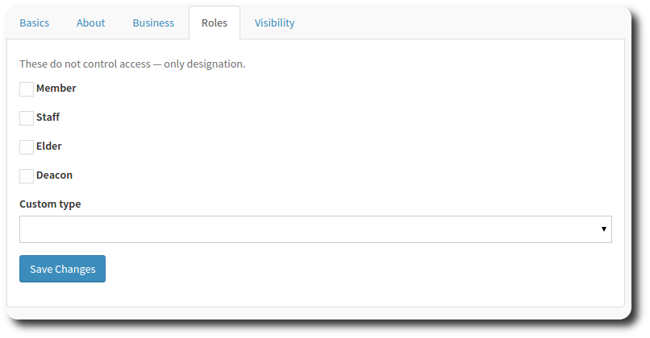
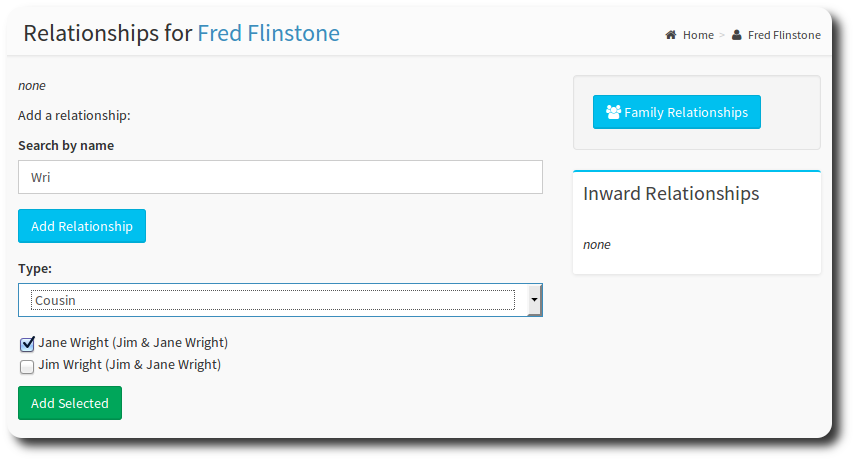
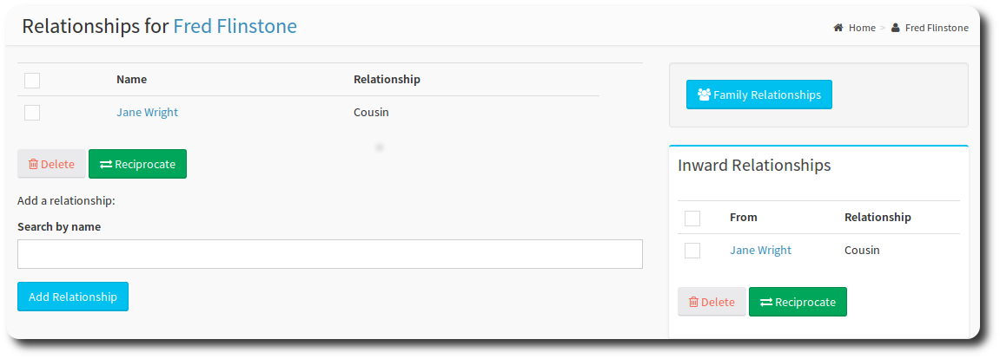
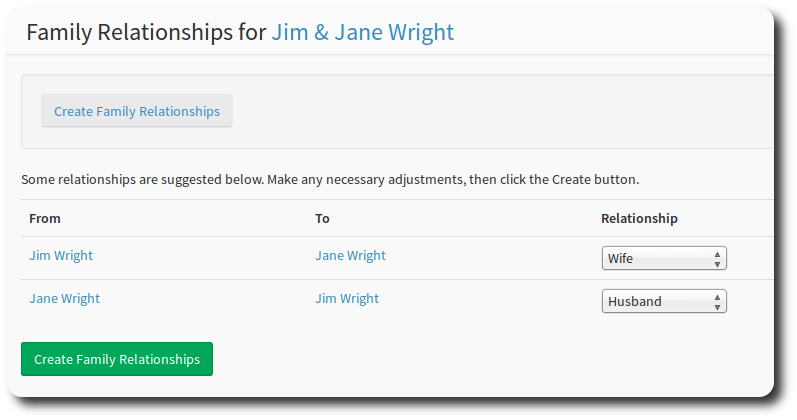
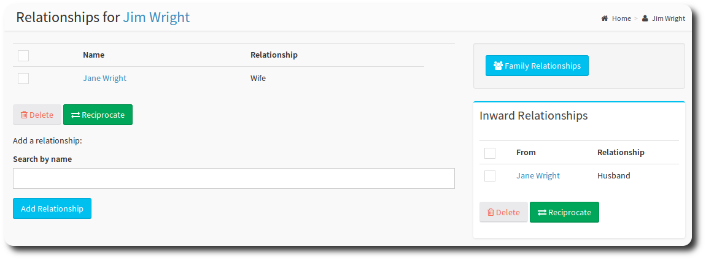

# Looking after People

>**info** This page assumes you have administrative rights for *people*.

Unless you have a small congregation, you will probably want to devolve some responsibility for managing people records to others in your church. This chapter provides some help to make this happen.

### Adding People Manually
In addition to the generally available fields, the profile supports a number of fields that are designated for adminstrative use.

| Field | Tab |Description |
| -- | -- | -- |
| Child | Basics | If a member is designated as a child, then their profile will automatically be Hidden. |
| Can Sign in | Visibility | Allows a user to sign in. Useful if you wish to pre-load records but prevent signin to the site until a specified time. |
| Visible to everyone | Visibility | Controls whether this person will be visible to regular users of the site. |
| Visible on printed directory | Visibility | Controls whether a record will appear in the PDF version of the directory. |
| Full Access | Visibility | If selected, a user will have full access to the site, otherwise the profile will be restricted when the user signs in. |

The *Send a password setup email to this user* button automatically generates a verification email to the users email address.

You can also specify [options](../administration/settings.html#members) for how member personal data updates should be handled.

### Roles

The roles tab contains check boxes to note a members' designation. Roles selected here will appear at the top of the profile and in the directory pages.

There are four predefined roles: Member, Staff, Elder, and Deacon. You can enable the custom type through the [settings page](../administration/settings.html#members). Hit the dropdown list to create your custom role.

#### Relationships

The Relationships page allows you to record family connections in your community.

1. From the profile menu, select the Relationships link.
2. Enter a name to narrow the search criteria
3. Select Add Relationship. The names of people matching the search criteria will be displayed.
4. Select the name(s) of the members you want to create the relationship for.
5. In the Type field, select the relationship type you would like.
6. Select *Add Selected* button.

Once a relationship is saved, you can view it on the relationships page. You can also **reciprocate**.  Reciprocation  creates a relationship record, but attached to the other person in the relationship.

To reciprocate:

1. Access the relationships page
2. Select the individual to reciprocate with
3. Hit *Reciprocate*

An inward relationship entry will appear for Fred, and this will also create a relationship record for Jane Wright.

##### Family Relationships

To have OneBody attempt to create family relationships for you:

1. Select the Family Relationships button
2. On the Family Relationships page,  hit the top Create Family Relationships button.
3. Make any adjustments needed to the relationship type, and;
4. Hit *Create Family Relationships*.

> **hint** If there isn't a relationship between two people, choose *none* as the relationship type.

This will automatically create relationship records for the individuals selected, as well as records at the family level.

### People Management Roles

The roles below can be granted to members who need to view or update personal information. Used together or individually, they can ensure that more than one person can update personal data in your church.

* View Hidden Profiles - will allow you to view any profiles marked as Hidden (e.g. Children)
* View Hidden Properties - allows viewing of details members may have hidden through [privacy](../people/README.html#setting-privacy-options) (such as birthday),
* Edit Profiles - Allows you to update a profile.

See the [Managing Admins](../administration/managing_admins.html) section for more detail on these settings.

