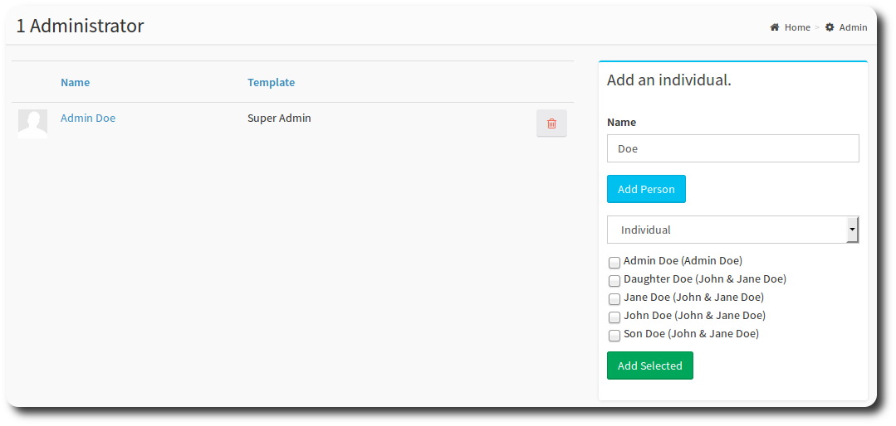
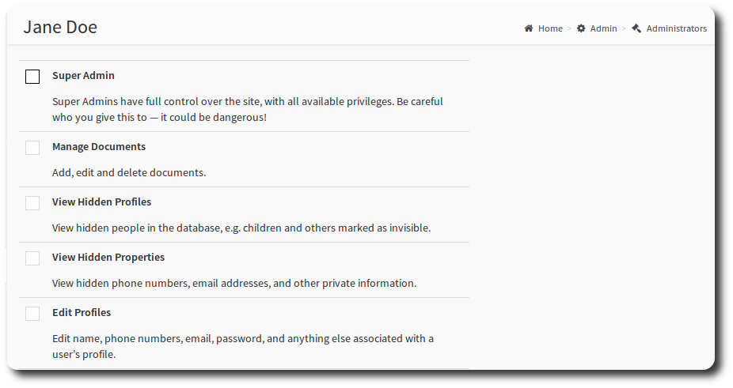
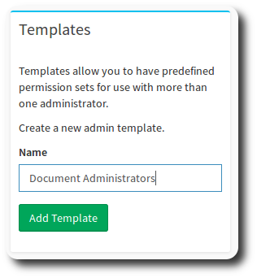
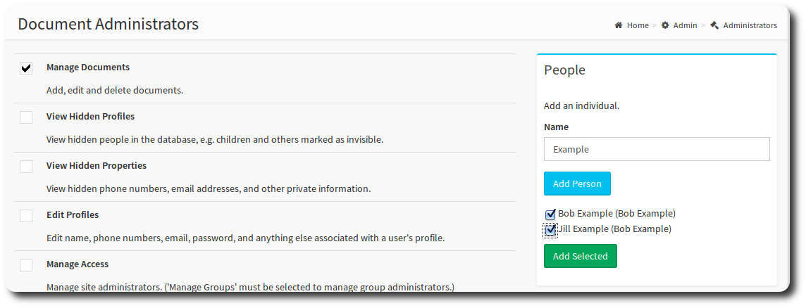

# Managing Administrators

Use this page to give any member administrative privileges they need to perform their role in the community. OneBody uses administrative *roles* to grant members groups of privileges, or tasks they can perform, for example, editing another users profile.

This page allows you to:

1. [Add a member as an administrator](../administration/managing_admins.html#add-a-member), and specify particular roles
2. Create an [administrative template](../administration/managing_admins.html#templates) with particular permissions.
3. Designate [Group Administrators](../administration/managing_admins.html#designating-group-administrators).

### Add a member
Search for an individual using the Name dialog. When you enter a name, OneBody brings back all families and people that meet that name. Select one (or multiple) members who you would like to give administrative roles to.

Click the individual's name. You'll be presented with a list of roles that you can add to the member. Select the relevant roles you would like to add, by selecting the checkboxes and saving.

### Templates

A template is a pre-defined listing of roles, which you attach to a member, or number of members. Templates improve the day-to-day admninstration of your roles and mean you can group like roles together to give to more than one member. This is particularly useful for setting standard permissions for groups of members.

Select **Create a new admin template** from the **Templates** section. You'll be prompted for a name. Enter the name (in this case, "Document Administrators") and select the green Add Template button.

You'll see the new template has been created in the Templates section. Select the name of the template, and then select all the roles that you would like to belong to the template.

You can then begin to assign people by searching for their name, checking their name, and selecting "Add Selected". You can repeat the process to add other people.

> Warning: If you later change the security on the template to add  additional roles, be aware that *all* members attached to that template will inherit the role.

### Designating Group Administrators

A core concept of OneBody is the *group*. A typical church could have many groups, some of whom you may not want to give *all* group administration rights to. For this reason, a specific page has been created for designating Group Administrators. Select the Manage Group Administrators link from the Group Administrators section, and on the next page, select *edit* next to the group you want.

Next to the member you want to make administrator, select the "promote to administrator" icon. A group can have more than one active administrator.

> Note. These pages detail the mechanics of how to add roles to members. For advice on designing your role setup, see the [Planning for OneBody](../planning_for_installation/README.html) section.

### Administrative Roles

Here's a full list of the roles that can be given to a member.

| Role | Description |
| -- | -- |
| Manage Documents | Add, edit and delete documents. |
| View Hidden Profiles | View hidden people in the database, e.g. children and others marked as invisible. |
| View Hidden Properties | View hidden phone numbers, email addresses, and other private information. |
| Edit Profiles | Edit name, phone numbers, email, password, and anything else associated with a user's profile. |
| Manage Access | Manage site administrators. *'Manage Groups' must be selected to manage group administrators.*|
| Manage Attendance | View, edit, and export attendance. |
| Manage Comments |Ability to delete any site comments. |
| Manage Groups | View, edit, delete any group (even if hidden or private). |
| Manage News | View, edit, delete all news. |
| Manage Notes | Note: this feature is deprecated. Edit and delete any notes. |
| Manage Pictures | View, edit, delete any pictures and albums. |
| Manage Updates | View, edit, delete pending profile updates made by users. |
| Manage Sync | View and track synchronizations made with UpdateAgent. |
| Import Data | Import data from CSV or by using UpdateAgent. |
| Export Data | Export all site data to XML or CSV. |
| Assign Checkin Cards | Assign card numbers to families. |
| Manage Checkin | Manage all aspects of checkin, including setup and configuration. |

