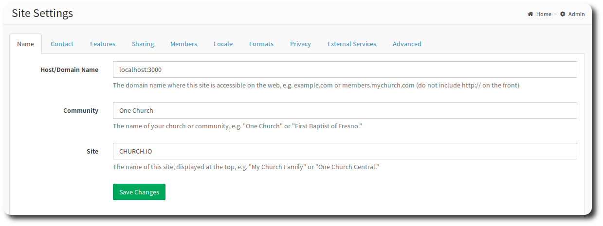
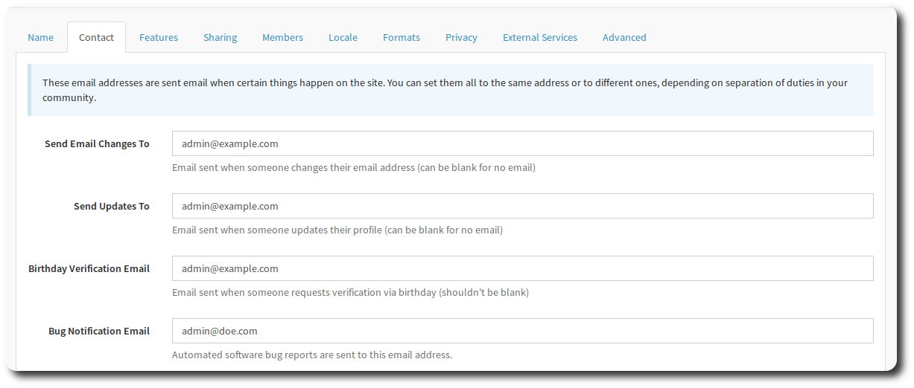
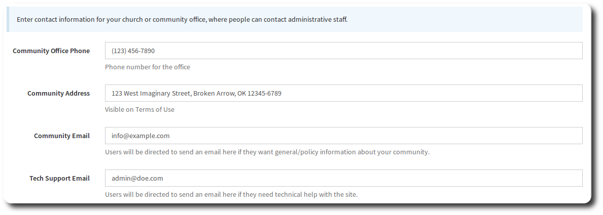

# Settings

The settings page contains options that are used on your site. You probably won't come here often, but when you do, you need to know what you're selecting!

### Name Tab

Field | Description
------------ | -------------
Host/Domain Name | Enter your domain name, without any leading http://www, like so: "example.com" or "members.mychurch.com"
Community Name | Enter the name of your community. This is displayed at the top left of the screen and also on the sign-in page, and is used in the verification email.
Site | The name of the site. Displayed on the top right, next to the user dropdown. Also used in the verification email.

### Contact Tab

This tab allows you to specify contact details (both email and physical) that are used throughout your site. You can set these to all the same details or different ones, depending on separation of duties in your community.

#### Email Addresses

Field | Description
------------ | -------------
Send Email Changes To | Email address notified when email addresses are changed. No email will be sent if the field is blank.
Send Updates To | Email address notified when a person updates their profile
Birthday Verification Email | Note: This field is deprecated.
Bug notification Email | Enter the email address that should receive OneBody bug reports. Typically, this would be the person responsible for technology in your church.

The [Members](#members) tab has more information on the options for controlling profile and email address updates.

#### Church/Community Contact Details

Field | Description
------------ | -------------
Community Office Phone | Enter the telephone number members should contact for OneBody support. This is also displayed in the verification email.
Community Address | Enter the physical address of your community. This is viewable on the terms of use.
Community Email | Users will be directed here if they want general information about your community.
Tech Support Email | Users will be directed to send an email here if they need technical help with the site.

#### Features

The settings on this page indicate the features that are present in your OneBody installation.

> Screen Shot omitted for brevity.

| Field | Description | More Detail |
| ------------ | ------------- | ------------- |
| Friends | Enable mutual friendships. | [How Frienships Work](../getting_started/README.html#about-friends) |
| Groups | Enable Groups. | [Groups](../groups/README.html) |
| Check-in |  Allows members to check-in to designated classes | Coming Soon! |
| Documents | If enabled, admins can upload files in a general area where members can browse and download them. | [Documents](../documents/README.html) |

#### Sharing

> Screen Shot omitted for brevity.

OneBody enables sharing of news, pictures and verses.

| Field | Description |
| -- | -- |
| News Page | Enable community news page. News items can be submitted by admins and/or pulled from an RSS feed (see External Services > News RSS setting). |
| News by User | Allow users to submit news content |
| Pictures | Enable Picture Sharing |
| Verses | Enable Verse Sharing |

### Members

This page contains allows you to configure member settings.

> Screen Shot omitted for brevity.

| Field | Description  |
| -- | -- |
| Notify on Photo Change | Admins will be notified whenever a user changes their personal or family photos. |
| Updates must be Approved | If enabled, all changes to a user's "basic" information (phone, address, etc.) will await approval from an admin before being applied. |
| Sign Up | If enabled, potential members can create their own login account on the site. It is highly recommended that you also enter an approval email address in the next field so that you can review signups before allowing login. |
| Sign Up Email | Where to send pending sign up requests (must be admin; leave blank to auto-approve). |
| Custom Person Type | If enabled, admins can specify a custom person type along the lines of Elder, Deacon, etc. |
| Adult Age | Age at which a person is considered old enough to use the site and be seen by others in the directory. |
| Suffixes | Name Suffixes, used on the person basic detail page. |

    What's the difference between a site and a community?
    eg. do multiple sites belong to one community?
    what happens with tech support email?

