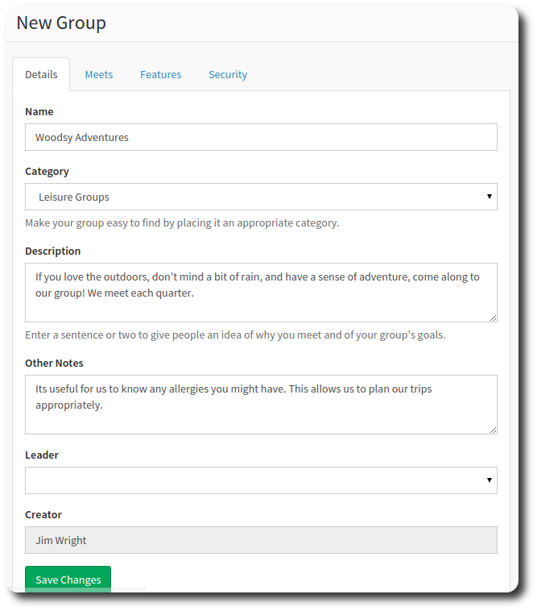
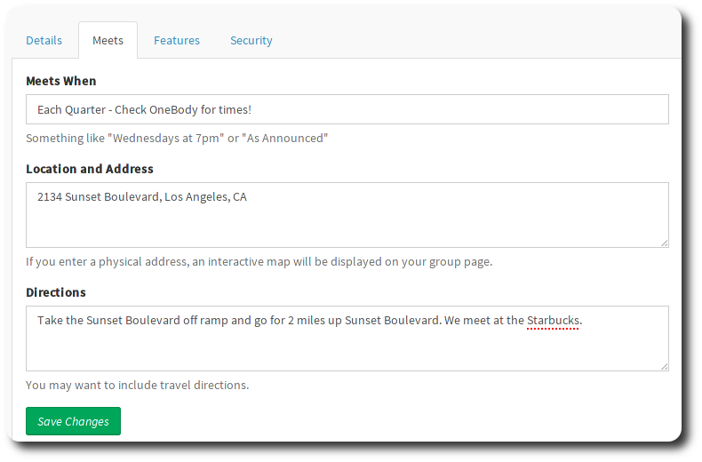
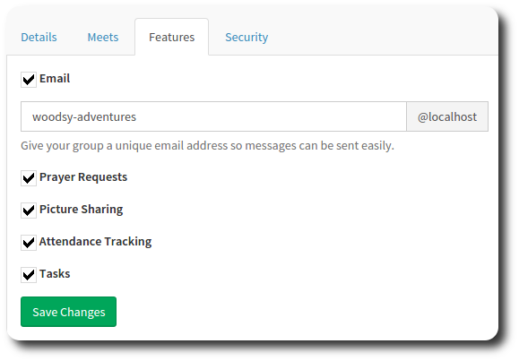
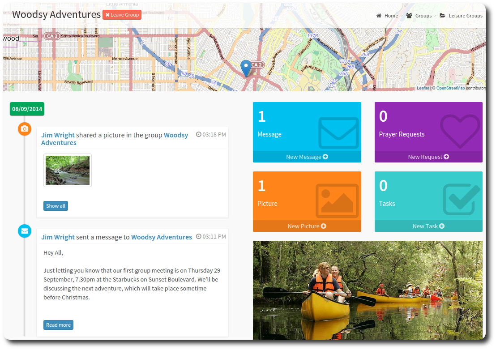

# Creating a Group

If you can't find a group, then you can always create one!

All groups require approval from a super administrator before they can accept members. This allows a degree of control over groups that are created and prevents inappropriate groups in your community.

There are four tabs you can complete to create your group.

#### Details

The Details tab records basic data about your group:

>**Info** Look for a broad category to put your group in.

If you create the group, you automatically become an adminstrator for the group.

Youll need to add some members to the group before you can nominate a group leader.

####Meets

The Meets tab to let others know about where the group gathers:

> **Success** Entering a physical address causes a streetmap to be displayed on your group.

The street map is displayed through Geocoding. Geocoding works out a precise location based on an address entered by a person.

Because computer speak <> human words, you might have to enter the address differently than you would normally, to get the correct result.

Example: Your address consists of five elements:
1. Line 1
2. Line 2  <<
3. Suburb  <<
4. City  <<
5. Postcode <<
5. Country

You may have to try different combinations of Line 2, Suburb City and Postcode in order for the geocoding service to recognise the address. Try removing some of the elements for the address to see if that improves the accuracy.

> Its usually not neccesscary to modify Line 1 or Country.

#### Features

The features tab controls which OneBody features you want to implement for your group.

**Email** will allow emails to be sent to and from your group email address. You can also share pictures and record attendance for your particular group.

More detail: [Tracking Attendance](../administration/looking_after_groups.html#tracking-attendance) and [Tasks](../groups/tasks.html).

####Security

Groups also come with security enabled. The security tab holds three settings:

1. **Approval Required to Join** - An administrator must approve all new signups to the group.
2. **Private Group** - A private group hides the group details (description, membership list) from non-members.
3. **Group Members can Post Messages** - Allows members to send a message to all other members in the group.

You can also share files with the group by uploading them.

That's it! You can now [post messages](../groups/posting_messages.html) share pictures, create [prayer requests](../groups/prayer_requests.html),and [track attendance](../administration/looking_after_groups.html#tracking-attendance) for your groups!

If you're a group leader, you might want to head on over to [Looking after Groups](../administration/looking_after_groups.html).

