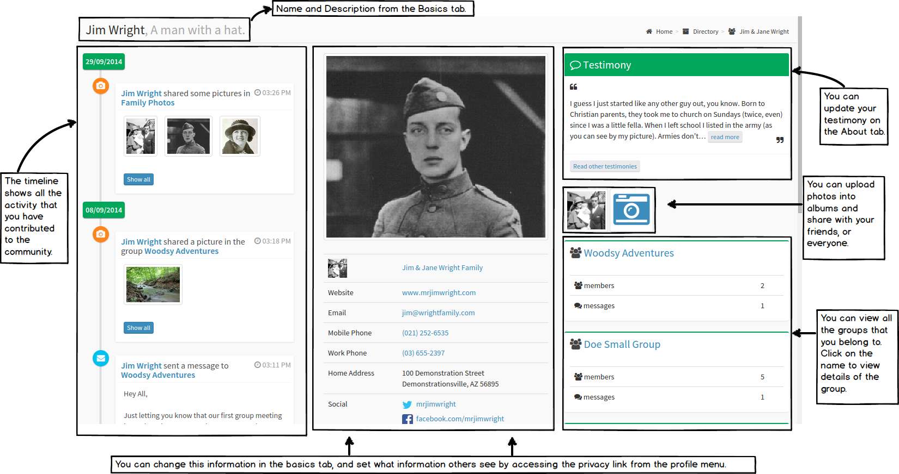
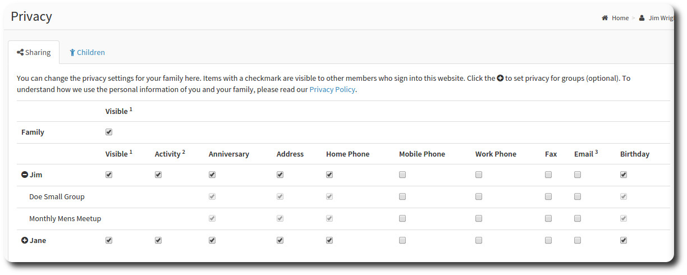
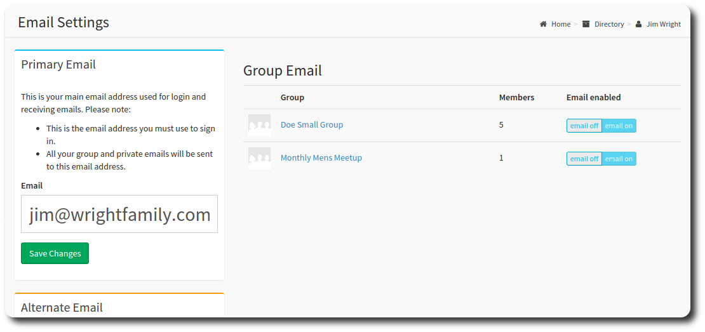

# Profile
Your profile is the centre of who you are in OneBody. From here you can share your testimony, upload a photo, and keep your personal details up-to-date for your church.

You can access Your Profile by clicking the *Profile* menu option.

### Your Profile

### Changing your Profile

We've assumed that most readers are familiar with basic details like name and address, so we're only going to talk about some of the fields that are a little more off the beaten track.

* The description field shows beside your name in your profile, and also appears in the online directory.

* Record the date of your wedding anniversary in the "Anniversary" field.

> **Hint** If you're entering page URL's, prefix with "http://" so OneBody recognises them.

#### Business Directory

If you'd like your community to know about your business, then you can add the details in the Business Tab. You can record your name, description and website, along with other details.

### Setting Privacy options

You might not want to share all your details with everyone that uses OneBody, and that's completely OK with us. You can choose what to share with *privacy*
settings.

If you don't want to appear to the commmunity at all, deselect the  *Visible* check box. This will cause you not to appear in any directory searches. Adults can set the visibilty option at a family level.

Hide your *activity* if you don't want to show your friends and fellow group members to see your public messages and verses on their home page.

At a personal level, you can select to hide your Anniversary, Address, Home Phone. Mobile and Work Phones, Fax, Email and most importantly, Birthday! You can also select to hide these fields for each group you are a member of.

### Email Settings

If you happen to change your email address, you'll need to update your address on the Email Settings page.

> **Caution** Primary email address change = Signin Change. Next signin use your updated email address.

You can also set to turn emails off (or on) for a specific group.

An alternate address can be added if you don't want OneBody emails to go to your primary address. No-one will be able to see this address, and you'll still need to use your primary email to sign in to OneBody.

> **Did you Know?** Two members can share the same login (email address) as long as their passwords are different.

### Updating your password
To change your password, navigate to the Password page. You'll need to enter your password twice, and passwords have a miniumum of five characters.
